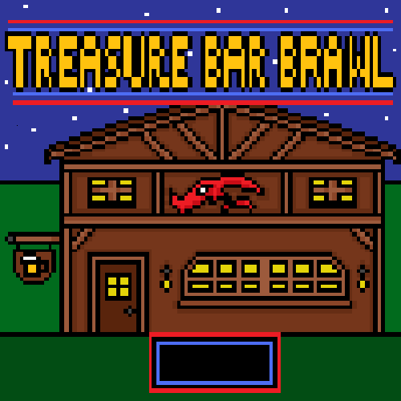

 # Treasure Bar Brawl

  # Table of Contents
  1. [Description](#description)
  2. [Installation](#installation)
  3. [Usage](#usage)
  4. [Collaborators](#collaborators)
  5. [Contact](#contact)
  

  ## Description
A turn based rpg that takes you through the local tavern...of monsters

## Installation 
no need to install just click the link and play!

## Usage
Click the render link below and Create your account and start playing! Use your arrow keys to move, space to enter battles, and your mouse to choose your attacks and choose who to hit.
Treasure Bar Brawl: https://treasure-bar-brawl.onrender.com

## Collaborators 
This was the combined efforts of Colton Doling, Baileigh Remy, Danyelle Kobes, and Tyler Caelwaerts

## Contact
GitHub: [Colton-Dol](https://github.com/Colton-Dol)
GitHub: [BaileighRemy](https://github.com/baileighremy)
GitHub: [Dkobes](https://github.com/Dkobes)
GitHub: [tiecaelwaerts](https://github.com/tiecaelwaerts)